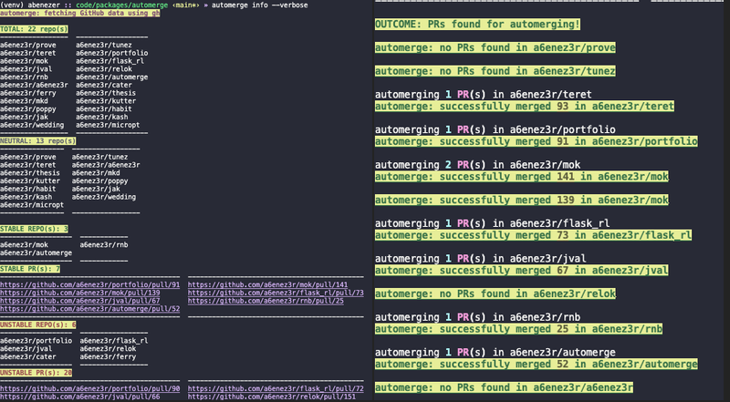

# `automerge` [](https://github.com/a6enez3r/automerge/actions/workflows/pipeline.yaml)

automerge is a simple python CLI that automatically merges GitHub PRs. By default it only merges PRs that **1**) pass all checks **2**) are authored by **dependabot**

it runs on top of the official `gh` CLI and requires you to
authenticate using `automerge login`



```

***

**commands**

***

*login*: log in to GitHub account

*logout*: log out of current GitHub account

*info*: get info abount PRs in current account

*merge*: take the name of a repo + a PR num & merge if stable

*automerge*: merge all valid PRs in current account

***

**util. functions**

***

*_from_url*: get owner/repo from git url

*_repos*: get all repos in current account

*_prs*: get prs for a given repo

*_stats*: get stats for current account

*_display*: display info abount current account

***

## install
`automerge` isn't available on `pypi` yet but you can install it

```bash
  $ git clone https://github.com/abmamo/automerge
  $ cd automerge
  $ python setup.py install
```

##  quickstart

```
automerge --help

Usage: automerge [OPTIONS] COMMAND [ARGS]...

  automerge is a simple python CLI that automatically merges GitHub PRs

Options:
  --help  Show this message and exit.

Commands:
  info    merge all stable/unstable PRs
  login   login to GitHub
  logout  logout of GitHub
  merge   merge all[stable] PRs
```
